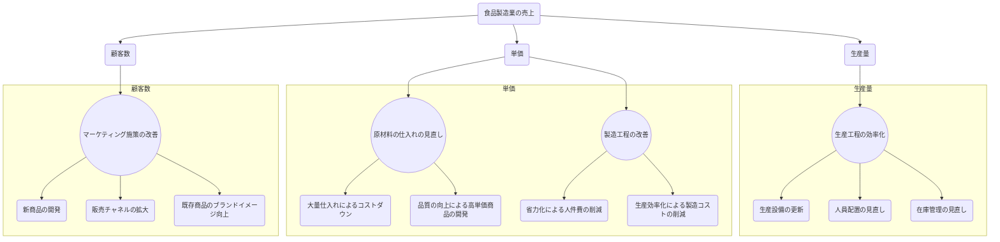

```mermaid
graph TD
A(食品製造業の売上)--> B(生産量)
A --> C(単価)
A --> D(顧客数)
B --> B1(生産工程の効率化)
C --> C1(原材料の仕入れの見直し)
C --> C2(製造工程の改善)
D --> D1(マーケティング施策の改善)

%% 生産量の改善案
subgraph 生産量
B1((生産工程の効率化))
B1 --> B1_1(生産設備の更新)
B1 --> B1_2(人員配置の見直し)
B1 --> B1_3(在庫管理の見直し)
end

%% 単価の改善案
subgraph 単価
C1((原材料の仕入れの見直し))
C1 --> C1_1(大量仕入れによるコストダウン)
C1 --> C1_2(品質の向上による高単価商品の開発)
end
subgraph 単価
C2((製造工程の改善))
C2 --> C2_1(省力化による人件費の削減)
C2 --> C2_2(生産効率化による製造コストの削減)
end

%% 顧客数の改善案
subgraph 顧客数
D1((マーケティング施策の改善))
D1 --> D1_1(新商品の開発)
D1 --> D1_2(販売チャネルの拡大)
D1 --> D1_3(既存商品のブランドイメージ向上)
end

```